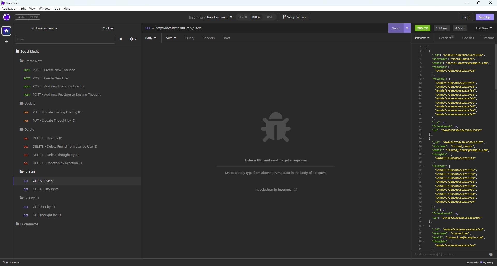
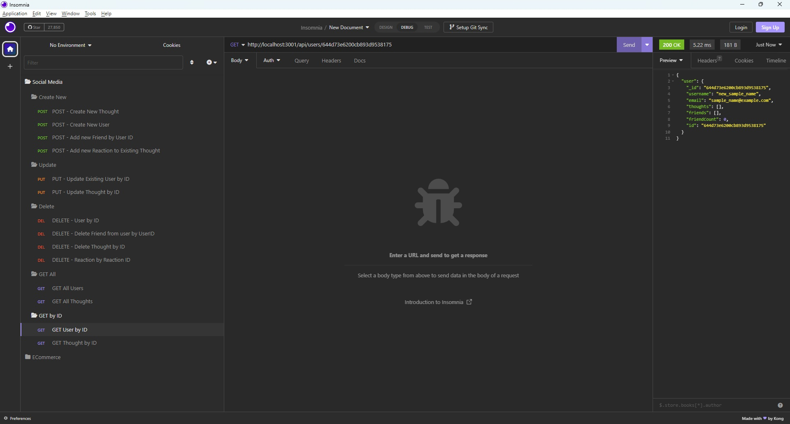
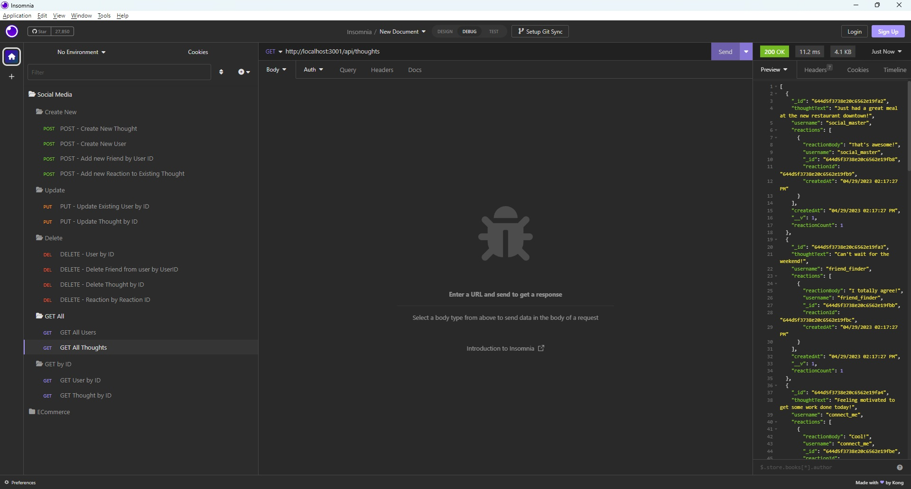
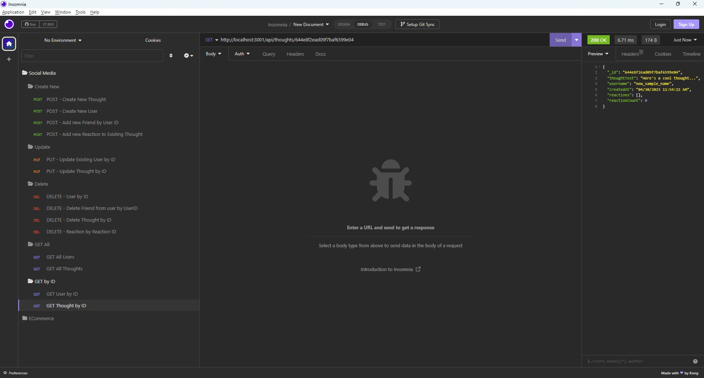

# Social Media API Back-End
This is the backend for a potential Social Media website that contains users with thoughts and where users can add reactions to the thoughts (posts).

[](https://opensource.org/licenses/MIT)

## Installation
To install this project, clone the repository to your local machine and run the following commands:

``` 
npm install
```
## Usage
To start the server, run the following command:
``` 
npm start
```
This will start the server on http://localhost:3001.

## Seed Databases by running:
``` 
npm start seed
```
This will load all databases with some test data
## The available routes are:

`/api/users`  
Display all Users

`/api/thoughts`  
Display all thoughts

`/api/users/:userId/friends/:friendId`  
Add/Delete Friends to a specific user

`/api/thoughts/:thoughtId/reactions`  
Add/Delete Reactions to a specific Thought


## Screenshots

Users  
  
User by ID  
  

Thoughts  


Thought by ID  



## Skills on display
- MongoDB
- Mongoose 
- GET/PUT/POST/DELETE API Routes

## Walkthrough Video
[Walkthrough Video]()
